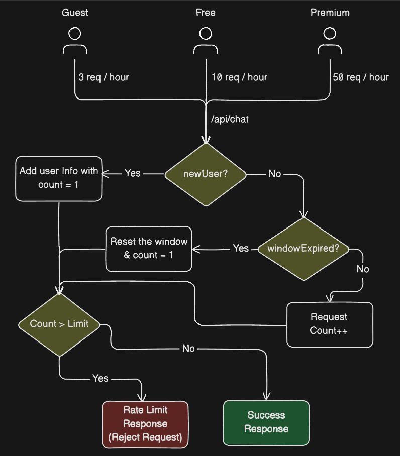

# Chatbot Throttle

**AI Chat Rate Limiter with Vercel AI SDK**

---

## Project Overview

This project is a **chatbot backend** built with **Node.js/Express** using the **Vercel AI SDK**. It enforces **rate limits** for different user types to **control AI usage costs**.

| User Type | AI Questions per Hour | Notes                                      |
| --------- | --------------------- | ------------------------------------------ |
| Guest     | 3                     | No Authorization header -> treated as Guest |
| Free      | 10                    | Logged-in user with Free plan              |
| Premium   | 50                    | Logged-in user with Premium plan           |

The backend tracks users by **user ID** (logged-in) or **IP address** (guests) and uses a **fixed window rate limiting algorithm** to prevent excessive AI calls.

---

## Features

* **Fixed Window Rate Limiting** (1-hour window)
* **User Types**: `Guest`, `Free`, `Premium`
* **JWT-based authentication** for logged-in users
* **In-memory request tracking**
* **Vercel AI SDK integration** with OpenAI `gpt-4o-mini`
* **Clear error messages** when rate limits are exceeded
* **Mock user data** stored in `users.json`
* **Environment configuration** via `.env` and `config.js`

---

## System Design

The system uses a **fixed window rate limiter** to manage AI usage.

### Architecture Diagram


*Illustrates rate limiting for `/api/chat` endpoint.*

### Flow:

1. Client sends a request to `/api/chat`.
2. Middleware `authenticate` checks the JWT token. If missing, user is treated as **Guest**.
3. `rateLimiter` checks usage for the current 1-hour window:

   * **Logged-in users** tracked by `user.id`
   * **Guests** tracked by `req.ip`
4. If within limit, the request is sent to **Vercel AI SDK** to generate a response.
5. AI response returned along with **remaining requests**.
6. If limit is exceeded, server responds with **429 status** and an error message.

---

## Project Structure

```
chatbot-throttle/
│
├─ assets/           # System design images
├─ config.js         # Environment variables and defaults
├─ constants.js      # Rate limits and time window constants
├─ server.js         # Express server & API endpoints
├─ users.json        # Mock user database
├─ package.json      # Project metadata and scripts
├─ README.md         # Documentation
├─ node_modules/     
└─ pnpm-lock.yaml    
```

---

## Setup Instructions

1. **Clone the repository**:

```bash
git clone https://github.com/fahimahammed/chatbot-throttle.git
cd chatbot-throttle
```

2. **Install dependencies**:

```bash
pnpm install
```

3. **Create `.env` file**:

```env
PORT=3000
JWT_SECRET=supersecret
JWT_EXPIRES_IN=1h
OPENAI_API_KEY=your_openai_api_key
```

4. **Run in development mode**:

```bash
pnpm dev
```

Server will start on `http://localhost:3000`.

---

## API Endpoints

### 1. Login

**POST** `/api/login`

**Description**: Authenticates a user using mock `users.json` data and returns a JWT token.

**Request Body**:

```json
{
  "username": "fahimahammed",
  "password": "fahim123"
}
```

**Response** (Success):

```json
{
    "success": true,
    "message": "User logged in successfully!",
    "token": "**********************************"
}
```

**Response** (Failure):

```json
{
    "success": false,
    "message": "Invalid username or password!",
    "error": "Invalid login request"
}
```

---

### 2. Chat (Rate-limited)

**POST** `/api/chat`

**Headers**:

```
Authorization: Bearer <jwt_token>
```

*If missing, the request is treated as a **Guest**.*

**Request Body**:

```json
{
  "message": "I want to learn rate limiting. Give me a roadmap for this."
}
```

**Response** (Success):

```json
{
  "success": true,
  "message": "AI response here...",
  "remaining_requests": 7
}
```

**Response** (Rate Limit Exceeded):

```json
{
  "success": false,
  "error": "Too many requests. Free users can make 10 requests per hour.",
  "remaining_requests": 0
}
```

---

### 3. Check Status

**GET** `/api/status`

**Headers**:

```
Authorization: Bearer <jwt_token>
```

*If missing, treated as **Guest**.*

**Response**:

```json
{
  "success": true,
  "message": "You are a free user & your request limit is 10 AI questions per hour.",
  "remaining_requests": 7
}
```

---

## Rate Limiter Implementation

* **Fixed Window**: Tracks requests in a 1-hour window.
* **Tracking**:

  * Logged-in users: by `user.id`
  * Guests: by `req.ip`
* **In-memory store**:

```js
{
  key: {
    count: number,
    windowStart: timestamp
  }
}
```

* **Behavior**:

  * Increment `count` for requests within the window
  * Reset `count` and `windowStart` after 1 hour
  * Return **429** when the limit is exceeded

---

## Testing Rate Limiting

1. Login as a user or use guest (no token).
2. Make multiple `/api/chat` requests within an hour.
3. Check `/api/status` to see remaining requests.
4. Observe **429 error** when the limit is exceeded.

---

## Testing Rate Limiting (All User Types)

### 1. Guest User (No Authorization Header)

**Limit**: 3 requests per hour

```bash
# Guest request 1
curl -X POST http://localhost:3000/api/chat \
-H "Content-Type: application/json" \
-d '{"message":"Hello AI"}'

# Guest request 2
curl -X POST http://localhost:3000/api/chat \
-H "Content-Type: application/json" \
-d '{"message":"How are you?"}'

# Guest request 3
curl -X POST http://localhost:3000/api/chat \
-H "Content-Type: application/json" \
-d '{"message":"Tell me a joke"}'

# Guest request 4 → Exceeds limit
curl -X POST http://localhost:3000/api/chat \
-H "Content-Type: application/json" \
-d '{"message":"Another request"}'
```

**Expected Response for 4th request**:

```json
{
  "success": false,
  "error": "Too many requests. guest users can make 3 requests per hour.",
  "remaining_requests": 0
}
```

---

### 2. Free User (Logged-in)

**Limit**: 10 requests per hour

```bash
# Login as Free user (fahimahammed)
curl -X POST http://localhost:3000/api/login \
-H "Content-Type: application/json" \
-d '{"username":"fahimahammed","password":"fahim123"}'

# Copy the returned token
TOKEN=<paste_jwt_token_here>

# Make 11 chat requests
for i in {1..11}; do
  curl -X POST http://localhost:3000/api/chat \
  -H "Authorization: Bearer $TOKEN" \
  -H "Content-Type: application/json" \
  -d '{"message":"Hello AI"}'
done
```

**Expected Response for 11th request**:

```json
{
  "success": false,
  "error": "Too many requests. free users can make 10 requests per hour.",
  "remaining_requests": 0
}
```

---

### 3. Premium User (Logged-in)

**Limit**: 50 requests per hour

```bash
# Login as Premium user (firoz)
curl -X POST http://localhost:3000/api/login \
-H "Content-Type: application/json" \
-d '{"username":"firoz","password":"firoz123"}'

# Copy the returned token
TOKEN=<paste_jwt_token_here>

# Make 51 chat requests
for i in {1..51}; do
  curl -X POST http://localhost:3000/api/chat \
  -H "Authorization: Bearer $TOKEN" \
  -H "Content-Type: application/json" \
  -d '{"message":"Hello AI"}'
done
```

**Expected Response for 51st request**:

```json
{
  "success": false,
  "error": "Too many requests. premium users can make 50 requests per hour.",
  "remaining_requests": 0
}
```

---

### 4. Check Remaining Requests

You can check remaining quota for any user type:

```bash
curl -X GET http://localhost:3000/api/status \
-H "Authorization: Bearer $TOKEN"
```

**Sample Response**:

```json
{
  "success": true,
  "message": "You are a free user & your request limit is 10 AI questions per hour.",
  "remaining_requests": 7
}
```

---

## Dependencies

* `express` – Web server
* `body-parser` – Parse JSON request bodies
* `jsonwebtoken` – JWT authentication
* `dotenv` – Environment variable management
* `@ai-sdk/openai` + `ai` – Vercel AI SDK integration

**Dev Dependencies**:

* `nodemon` – Auto-reload for development

---

## Notes

* In-memory storage resets on server restart. Use Redis or a database for production.
* Mock users are for testing purposes only.
* `OPENAI_API_KEY` must be set in `.env` for AI calls.
* Rate limits can be adjusted in `constants.js`.